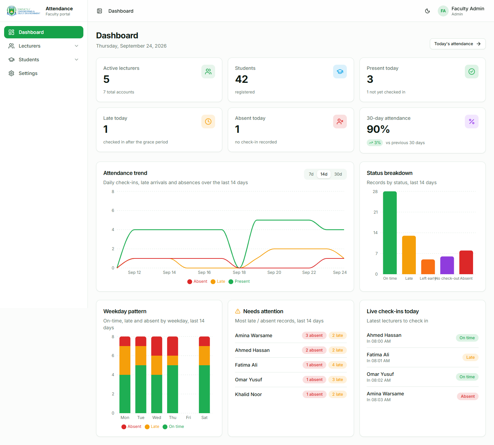
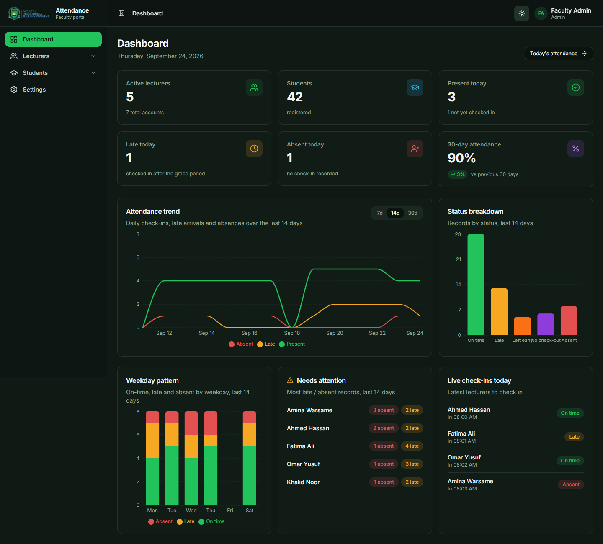

# FEBE Attendance

Attendance system for a university faculty. Lecturers check in and out by scanning a printed QR code, students check in to each class session, and campus presence is verified with a **rotating on-screen code** and **browser geolocation**. Administrators manage lecturers, students, the timetable and the rules, and get live dashboards and reports.

It replaces the faculty's Google Sheet ("Latest Lecturer Attendance") and keeps its rules: on-time / late / absent / left-early / no-check-out.

| | |
|---|---|
| **Frontend** | React 18, Vite, Tailwind CSS, shadcn/ui, Framer Motion, TanStack Table, Recharts |
| **Backend** | Python 3.12, Flask, SQLAlchemy, JWT, APScheduler, Flask-Limiter |
| **Database** | PostgreSQL 16 |
| **Deploy** | Docker Compose + Caddy (automatic HTTPS) |

<p align="center">
  
  
</p>
<sub>Screenshots use sample data.</sub>

## Contents

- [Features](#features)
- [Repository layout](#repository-layout)
- [Quick start (development)](#quick-start-development)
- [Configuration](#configuration)
- [Loading the faculty data](#loading-the-faculty-data)
- [Testing](#testing)
- [Deployment](#deployment)
- [Security](#security)
- [Attendance rules](#attendance-rules)
- [Documentation](#documentation)

## Features

**Lecturers**
- One check-in and one check-out per day, however many classes they teach (measured against the first class's start and the last class's end).
- Campus verification by rotating kiosk code and/or geolocation (mode is configurable).
- Show a fast-rotating class code for students; review and correct their own students' attendance (a remark is mandatory and recorded).

**Students**
- Self-registration with email confirmation; pre-imported roster records are *claimed* by student ID.
- Per-session check-in with the lecturer's class code plus location; personal timetable and attendance report.
- Automatic block and retake flag when absences reach the configured threshold (default 25 %).

**Administrators**
- Dashboard with KPI cards, attendance trend (line), status breakdown and weekday pattern (bar), "needs attention" and live check-ins.
- Advanced data tables everywhere: search, filters, sorting, column visibility, pagination, row selection, CSV export.
- Manage lecturers, students, admins, timetable and all rules; monthly reports with justified / unjustified absences.
- Printable QR codes, kiosk display link, printable student reports.

**Platform**
- Green/white theme with a light/dark toggle, multi-level sidebar, fully responsive.
- Background scheduler marks absences and missed check-outs and emails check-in reminders.

## Repository layout

```
.
├── backend/                  Flask API
│   ├── app/
│   │   ├── auth/ admin/ attendance/ kiosk/ lecturer/ student/   # blueprints (routes)
│   │   ├── utils/            # business logic: schedule, status rules, validation, authz, email…
│   │   ├── importers/        # Excel/roster import commands
│   │   ├── models.py  config.py  security.py  extensions.py  jobs.py
│   ├── tests/                # pytest suite
│   ├── Dockerfile  docker-entrypoint.sh  requirements*.txt  run.py
├── frontend/                 React SPA
│   └── src/
│       ├── api/  context/    # axios client, auth provider
│       ├── components/       # ui/ (shadcn), layout/ (sidebar, shell), data-table, charts…
│       └── pages/            # admin/ lecturer/ student/ auth/ kiosk/ reports/
├── deploy/                   Caddyfile, web image, env generator
├── docs/                     Architecture, deployment, data import, security notes
├── data/                     Source spreadsheets (git-ignored: personal data)
├── docker-compose.yml        Production stack (db + backend + web)
├── .env.production.example   Production settings template
└── SECURITY.md               Audit results and operator checklist
```

## Quick start (development)

Requirements: Python 3.12+, Node.js 20+, PostgreSQL 15+.

```bash
# 1. Database (psql)
CREATE USER febe_user WITH PASSWORD 'febe_password';
CREATE DATABASE febe_attendance OWNER febe_user;

# 2. Backend  →  http://localhost:5000
cd backend
python -m venv .venv && source .venv/bin/activate      # Windows: .venv\Scripts\Activate.ps1
pip install -r requirements-dev.txt
cp .env.example .env                                   # edit as needed
flask init-db          # tables + default settings
flask seed-admin       # first admin from DEFAULT_ADMIN_* in .env
flask run

# 3. Frontend  →  http://localhost:5173   (new terminal)
cd frontend
npm install
cp .env.example .env
npm run dev
```

Sign in at `http://localhost:5173/login` with the seeded admin, **then change the password**.
Until `MAIL_USERNAME` is set, outgoing emails are logged to the backend console instead of sent.

## Configuration

Development uses `backend/.env` (see `backend/.env.example`); production uses the repo-root `.env` (see `.env.production.example`).

| Variable | Purpose |
|---|---|
| `APP_ENV` | `development` or `production`. **Production refuses to start with placeholder secrets, a default DB password, a non-HTTPS origin or no time zone.** |
| `APP_TIMEZONE` | Campus IANA time zone, e.g. `Africa/Mogadishu`. All schedule maths uses campus-local time. |
| `DATABASE_URL` | SQLAlchemy URL for PostgreSQL. |
| `SECRET_KEY`, `JWT_SECRET_KEY` | ≥ 32 random characters. |
| `KIOSK_TOTP_SECRET`, `KIOSK_ACCESS_KEY` | Rotating campus code seed and the secret in the kiosk URL. |
| `STUDENT_CODE_TOTP_SECRET` | Seed for the fast-rotating student class code. |
| `FRONTEND_ORIGIN`, `FRONTEND_BASE_URL` | Allowed CORS origin and the base URL used in emails. |
| `TRUSTED_PROXY_COUNT` | Reverse proxies in front of the API (1 behind Caddy) so rate limiting sees real client IPs. |
| `MAIL_*` | SMTP settings for invites, verification, password reset and reminders. |

Runtime rules (thresholds, campus location, verification mode, holidays, semester dates) are edited in **Admin → Settings** and validated server-side.

## Loading the faculty data

Lecturers, students, courses, rooms, batches and the timetable come from the faculty's spreadsheets. They contain personal data, so they live in `data/` and are **never committed**.

```bash
flask import-excel "../data/Latest Lecturer Attendance.xlsx"
flask import-confirmed-timetable "../data/Time_Table_OCTOBER 2026 - FEB 2027 (1).xlsx"
flask import-students "../data/stdsRegistered23092026_064554.xls"
```

Order matters and one command replaces the timetable, so read [docs/DATA_IMPORT.md](docs/DATA_IMPORT.md) first.

## Testing

```bash
cd backend && pytest -q          # authentication, sessions, validation, business rules, config guard
cd frontend && npm run build     # type/compile check of the SPA
```

GitHub Actions (`.github/workflows/ci.yml`) runs both, and builds the Docker images, on every push.

## Deployment

Production runs as three containers on a single VPS: PostgreSQL, the gunicorn API and Caddy (which serves the built SPA, proxies `/api` and manages the HTTPS certificate).

```bash
git clone https://github.com/MrHanad-Shariif/febeattendance.git && cd febeattendance
python3 deploy/generate_env.py > .env      # random secrets; then set the admin email + mail settings
docker compose up -d --build
```

Full walk-through (DNS, firewall, data import, backups, updates): [docs/DEPLOYMENT.md](docs/DEPLOYMENT.md).

## Security

Authentication uses short-lived JWTs that are re-validated against the database on every request (disabled users and role changes take effect immediately; changing a password signs out all other sessions). Login, password reset, registration, kiosk and check-in endpoints are rate limited; all input is validated; uploads are decoded and re-encoded; responses carry security headers and a strict CSP.

The full audit, what was fixed, remaining risks and an operator checklist are in [SECURITY.md](SECURITY.md).

## Attendance rules

Configurable in **Admin → Settings** (defaults from the original spreadsheet):

| Setting | Default | Meaning |
|---|---|---|
| `late_after_minutes` | 10 | Checked in later than this after the first class starts → **Late** |
| `absent_after_minutes` | 50 | No check-in (or later than this) → **Absent** |
| `left_early_minutes` | 25 | Checked out this early before the last class ends → **Left early** |
| `no_checkout_after_minutes` | 90 | Checked in but never out → **No check-out** (also flagged on later days) |
| `reminder_minutes_before` | 15 | Email lecturers who haven't checked in yet |
| `verification_mode` | both | `both`, `either`, `code_only`, `location_only`, `off` |
| `student_absence_threshold_percent` | 25 | Absence share of the semester's planned sessions that blocks check-in and flags a retake |
| `no_class_dates` | – | Holidays, e.g. `2026-10-01,2026-12-25` |

Students can check in from 30 minutes before a session starts until it ends.

## Documentation

| | |
|---|---|
| [docs/ARCHITECTURE.md](docs/ARCHITECTURE.md) | Components, data model, request and check-in flows |
| [docs/DEPLOYMENT.md](docs/DEPLOYMENT.md) | VPS deployment, HTTPS, backups, updates, troubleshooting |
| [docs/DATA_IMPORT.md](docs/DATA_IMPORT.md) | Importing lecturers, students, timetable |
| [SECURITY.md](SECURITY.md) | Security review, hardening, known limitations |
