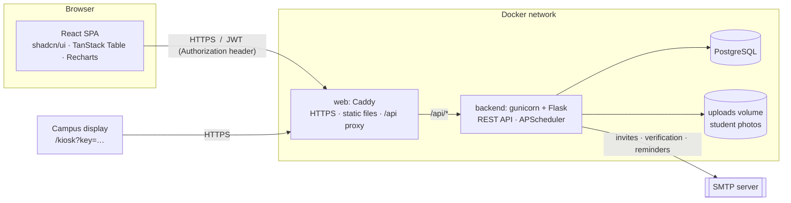
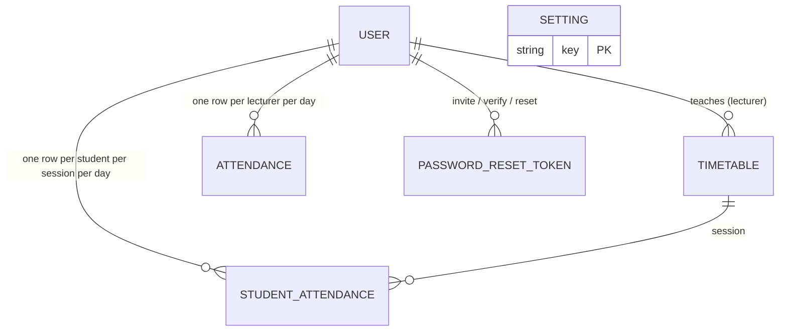

# Architecture

## Components

The SPA and API share one origin in production (`/api`), so no CORS is involved; in development Vite (5173) calls Flask (5000) and CORS is restricted to `FRONTEND_ORIGIN`.

## Backend

| Package | Responsibility |
|---|---|
| `app/__init__.py` | App factory, blueprint registration, CLI commands (`init-db`, `seed-admin`, `import-*`) |
| `app/security.py` | Production config guard, time zone, proxy headers, security headers, JSON error handlers |
| `app/config.py` | Environment-driven configuration and the production safety check |
| `app/models.py` | `User`, `Timetable`, `Attendance`, `StudentAttendance`, `StudentFace`, `FaceCheckAttempt`, `Setting`, `PasswordResetToken` |
| `app/auth/` | Login, registration, email verification, invite/activate, password reset |
| `app/admin/` | Lecturers, students, admins, timetable, settings, attendance, reports, QR codes |
| `app/attendance/` | Lecturer check-in / check-out |
| `app/lecturer/` | Lecturer's own day/history, per-session QR code and class code, their students' attendance |
| `app/student/` | Timetable, today's sessions, step-by-step check-in, face registration, report |
| `app/kiosk/` | Rotating campus code for the wall display |
| `app/utils/` | Pure business logic: `schedule`, `status`, `student_status`, `validation`, `authz`, `email`, `uploads`… |
| `app/committees/` | Committees, members, faculty roles (Dean, Administration Team), committee tasks + attachments |
| `app/meetings/` | Meeting scheduling/agendas, minutes publishing and the minutes archive |
| `app/notices/` | Information Sharing (faculty notices) |
| `app/notifications/` | The signed-in user's in-app notifications |
| `app/reports/` | Committee task/activity reports (JSON + CSV) and the Dean's faculty overview |
| `app/archive/` | Committee archive: memos (written in the system or uploaded), meeting agendas, reports |
| `app/assignments/` | Class assignments, per-student extensions, submissions (any file type) and lecturer comments |
| `app/utils/pdf.py` | The single FEBEMS document template (letterhead, title band, details, sections, signatures) used for memos, agendas and task reports |
| `app/importers/` | One-off Excel/roster import commands |
| `app/jobs.py` | Scheduled tasks (every 1–2 min) |

### Request pipeline

1. `ProxyFix` (if behind Caddy) → real client IP.
2. Flask-Limiter (per IP, per email or per user, depending on the route).
3. `roles_required(...)`: verify JWT → reload user → check `status == active`, role matches the database, password fingerprint matches → role check.
4. Route handler: validate input with `utils/validation.py` (raises `ValidationError` → 400).
5. `after_request`: security headers. Any uncaught exception becomes a logged `500 {"error": …}`; no tracebacks reach clients.

### Sessions

Stateless JWT (8 h, `Authorization: Bearer`). Because every request re-reads the user, revocation is immediate for disabling, deletion, role change and password change (the token's `pv` claim is a fingerprint of the current password hash). The SPA stores the token in `localStorage` and signs out on any `401`.

## Check-in flows

**Lecturer** (once a day). `POST /api/attendance/checkin` → find today's classes from the timetable (respecting `no_class_dates`) → reject if none or already checked in → verify campus presence per `verification_mode` (rotating kiosk code and/or distance from the campus point) → compute status against the *first* class's start (`on_time` / `late` / `absent`) → store. `checkout` compares against the *last* class's end (`left_early`), and the scheduler later flags `no_checkout`.

**Student** (per session, step by step). The lecturer's class-code screen shows a QR code for one class session: `/student-checkin?s=<token>`, where the token is the signed `(timetable_id, date)` (`utils/checkin_session.py`). After signing in:

1. `POST /api/student/checkin/start {s}`: the session must belong to the student's batch (otherwise a `403` "belongs to another class"), run today, be inside the check-in window (30 min before → end), not be checked in already, and the course must not be blocked by absences (records an absence and returns a `403` with the stats). Returns a signed **ticket**.
2. `POST …/code {ticket, code}`: the session's own class code (below).
3. `POST …/location {ticket, lat, lng}`: distance from the campus point ≤ `campus_radius_m`. The student then taps **Confirm**.
4. `POST …/complete` (multipart: `ticket`, `frontal`, `turned`): live face scan. The head must turn in the direction the ticket chose (left/right), both frames must be one face, and the frontal face must match the student's registered face (cosine similarity ≥ `face_match_threshold`). Failures are logged in `face_check_attempts`; after `face_max_attempts_per_session` the session is locked and the lecturer records attendance manually. On success → `on_time`/`late`.

The ticket (5 min, bound to the student and session) records which steps passed, so the fast-rotating code need not still be valid at the end. `student_verification_mode` and `student_face_verification` decide which steps apply.

**Faces** (`utils/face.py`): OpenCV YuNet detector + SFace recognizer on the CPU (~80 ms per frame, ~150 MB RAM), at most two jobs at once. Registration (at sign-up via a signed enroll token, or `POST /api/student/face` after sign-in) takes three frontal frames and one head-turned frame, rejects a face already registered to another account, and stores only the embeddings (`student_faces`) plus a profile photo crop. Admins can reset a face (`DELETE /api/admin/students/<id>/face`).

**Verification** codes are TOTP values (`pyotp`): the kiosk code changes every 60 s (URL guarded by `KIOSK_ACCESS_KEY`). The class code (6 digits, every 20 s, shown only to signed-in lecturers) uses a separate secret per class session derived from `STUDENT_CODE_TOTP_SECRET`, so one batch's code is useless in another's session. Each accepts ±1 window for clock drift.

## Scheduler (in-process, single worker)

| Job | Every | Does |
|---|---|---|
| `mark_absentees` | 2 min | Lecturers who haven't checked in `absent_after_minutes` after their first class → `absent` |
| `mark_no_checkouts` | 2 min | Checked in, never out, `no_checkout_after_minutes` after the last class → `no_checkout` (today **and earlier days**) |
| `send_checkin_reminders` | 1 min | Email lecturers not yet checked in shortly before class |
| `mark_student_absentees` | 2 min | Students with no check-in after `student_absent_after_minutes` → `absent` |
| `flush_email_outbox` | 1 min | Sends up to 50 queued committee/notice emails (3 attempts each) |
| `task_deadline_sweep` | 15 min | 24 h deadline reminder, and a one-time overdue notice to the assignee and chairperson |

All timestamps are naive **campus-local** datetimes; `APP_TIMEZONE` fixes the process time zone so this is correct on a UTC server.

## Data model (summary)

`USER.role` is `admin | lecturer | student`; `USER.status` is `invited | pending_verification | active | disabled`. Uniqueness is enforced in the database (`(lecturer_id, date)`, `(student_id, timetable_id, date)`), and the API converts races into `409`.

## Committees & task management module

An extension of the same app: same logins, `users` rows, email and branding.

- **One account, many roles.** `User.role` is unchanged (`admin | lecturer | student`). Extra responsibilities are data: `faculty_roles` (`dean`, `admin_team`) and `committee_members` (`member` / `chairperson`, mirrored in `committees.chairperson_id`). The Administration Team is a committee with `kind='administration'`, so it reuses tasks, meetings and minutes.
- **Permissions** live in `utils/permissions.py` and are checked on the server for every request, against the record being acted on. Only a committee's chairperson manages its tasks and meetings; being a member, the Dean or an admin does not grant that, unless an admin turns on the `dean_task_override` setting. Admins alone create committees and assign chairpersons and members. Administration Team members and admins publish minutes. The Dean, admins and the Administration Team share faculty information. `/auth/me` returns a `capabilities` block that the SPA uses to build its menu. It is for display only.
- **Audit trail.** Every task change writes a `task_events` row (`utils/task_audit.record_event`): created, assigned, edited, deadline changed, reassigned, status changed, completed, file uploaded, notification sent.
- **Notifications & email.** `utils/notify.notify()` writes `notifications` rows and queues `email_outbox` rows addressed to each user's stored email. It uses the fixed subject lines, e.g. `New Task Assigned – …` and `FEBE Meeting Minutes Published – …`. The scheduler sends the queue.
- **Minutes ↔ Information Sharing.** Publishing minutes stores the release time, archives them in `meeting_minutes`, and creates a linked `information_posts` row (category `meeting_minutes`). That row notifies the committee, or all staff for faculty-wide minutes.
- **Documents** (agendas, minutes, task evidence, notices) are stored under `uploads/private/…` and checked by content. They are served only by per-record routes that re-check permission. The generic `/api/uploads/…` route refuses `private/`.
- **Printable output.** `/print/minutes/:id` and `/print/report` use the existing logo and the "Faculty of Engineering and Built Environment (FEBE)" letterhead, and are printed or saved as PDF from the browser. Reports also download as CSV.
- **Secretary.** `committee_members.role` is `member | chairperson | secretary`. `permissions.is_chair()` is true for both officers, so the secretary has every chairperson permission (tasks, meetings, reports, archive).
- **Archive.** `archive_documents` rows have a `category` (`memo | agenda | report`) and a `source` (`created` = rendered by FEBEMS, `uploaded`). Completing a task files its standard report (`utils/archive.file_task_report`); scheduling or editing a meeting files its agenda (the uploaded file, or a PDF generated from the agenda text). Visibility: `permissions.archive_committee_ids()`.
- **Assignments.** `Assignment.deadline_for(student)` is the later of the class deadline and the student's `assignment_extensions` row; every upload and file removal is refused after it. Submission files are stored without an extension and only ever served as `application/octet-stream` attachments.
- New tables are created by `flask init-db` (`db.create_all`), which never drops tables; columns added to existing tables are listed in `NEW_COLUMNS` in `app/__init__.py` and added with `ALTER TABLE ... ADD COLUMN`.

## Frontend

- **Routing** (`App.jsx`): public auth pages, standalone pages (kiosk, class code, printable report), and everything else inside `AppLayout` (sidebar + top bar) guarded by `ProtectedRoute` with role checks.
- **Navigation** (`components/layout/nav-config.js`): one multi-level menu definition per role, rendered by a recursive sidebar (collapsible, icon-only mode, mobile drawer) and reused for breadcrumbs.
- **Data tables** (`components/data-table.jsx`): one TanStack-Table-based component used by every list.
- **Theme**: CSS variables (green primary, white surfaces) with a class-based dark mode; the pre-paint script is an external file so a strict CSP works.
- **API client** (`api/client.js`): axios instance that attaches the token and signs out on `401`. Protected images use `components/auth-image.jsx`.
